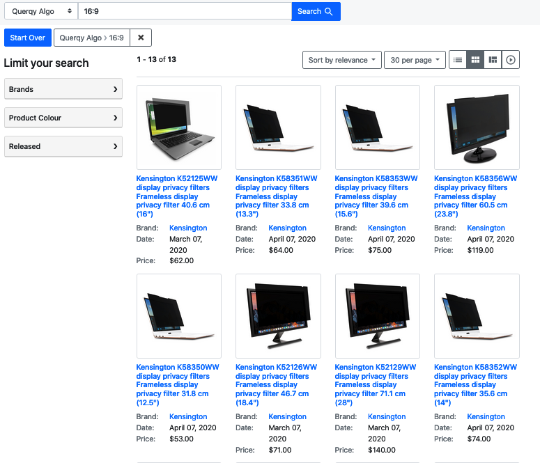

# Sixth Kata: Let's understand how to consume some common query patterns with Regex

Sometimes people use a short hand syntax that has a very strong correlation with a specific set of products.  For example, if you are on a home improvement website, and you get queries like `2x4x8`, well that is very strong signal that someone is looking for lumber!   On our Chorus Electronics site, any queries that include a pattern like this: _16:9_, _16:10_, _4:3_ are indicative of someone interested screen protectors for laptops.   The numbers are indicative of specific [display aspect ratio](https://en.wikipedia.org/wiki/Display_aspect_ratio) that each laptop screen has.   So in this Kata we'll learn how to use regular expressions to capture these patterns and narrow the results to just screen protector products made by the brand Kensington.

_In a perfect world, we would be supporting the decision to add this rule based on analytics data from our click logs or by looking at exit rates._


We're going to take advantage of how extendable Querqy is by using a custom rule that supports matching Regex patterns, and then applying a traditional `FILTER` rule.   The `querqy.regex.solr.RegexFilterRewriterFactory` is currently not supported in SMUI, so we'll need to work directly with the Querqy API's in Solr, but don't worry, it's pretty simple.

_This is a brand new piece of code for Querqy, so it has limitations we'll document at the end.  We will update this Kata as it evolves towards a 1.0 version._

We'll start by confirming that we've added the Java JAR file that contains this code to our Solr setup in `solr/lib` directory.   You should have a file with the name `querqy-regex-filter-1.1.0-SNAPSHOT.jar`.  If you don't, you'll need to go to the Github project at https://github.com/renekrie/querqy-regex-filter and download and compile the jar file via `mvn package`.  Restart Chorus and you'll be ready to continue.

The next step is think about the pattern you want to identify, and how you will tweak the rule.  

In our case, we know that any query that looks like *number*, followed by a colon, *:*, followed by a *number* is a strong indicator of aspect ratio.   For any query with an aspect ratio pattern, we want to filter to the brand Kensington as they make screen protectors where this makes sense.   Our rule definition will look like this:

```
{
   "class":"querqy.regex.solr.RegexFilterRewriterFactory",
   "config":{
     "regex":"\\d+:\\d+",
     "filter" : "* filter_brand:Kensington",
   }
}
```

You can see that the regex pattern is `\d+:\d+`, however we escaped the backslashes due to the JSON formatting.  We then apply the filter to say we want to append the filter for the brand Kensington.  You can try out the regex pattern using a site like https://www.regextester.com and the string "16:9".   We pass the original query through, so that if your query is _16:9_ it will float to the top, if you did say an aspect ratio and a model number, _K58357WW 16:9, then both would be passed through.

Once you have decided the pattern, we register it with Solr:

```
curl -X POST 'http://localhost:8983/solr/ecommerce/querqy/rewriter/regex_screen_protectors?action=save' -d '
{
  "class": "querqy.regex.solr.RegexFilterRewriterFactory",
  "config": {
    "regex":"\\d+:\\d+",
    "filter" : "* filter_brand:Kensington"
  }
}
'
```

Notice that the end point we use names the rewriter `regex_screen_protector` in conjunction with the `action=save` parameter?  You can confirm the change via:

```
curl -X GET http://localhost:8983/solr/ecommerce/querqy/rewriter/regex_screen_protectors
```

You may need to reload the collection as well:

```
curl -X POST http://localhost:8983/api/collections/ecommerce -H 'Content-Type: application/json' -d '
  {
    "reload": {}
  }
'
```


Now, we can test this rewriter by issuing a query with the `querqy.rewriters=regex_screen_protector` parameter.
<!-- In the future, leverage SOLR-6152 to make this query prepopulated in the Solr Query Admin UI -->

```
curl -X GET 'http://localhost:8983/solr/ecommerce/select?q=16:9&defType=querqy&querqy.rewriters=regex_screen_protectors&fl=title,brand,attr_t_aspect_ratio'
```

We get back 13 different Kensington screen protectors.   Now, lets pass in some extra query information, like the model number _K58357WW_.   

```
curl -X GET 'http://localhost:8983/solr/ecommerce/select?q=16:9%20K58357WW&defType=querqy&querqy.rewriters=regex_screen_protectors&fl=title,brand,attr_t_aspect_ratio'
```

Boom!  We get just a single product result back:

```
"response":{"numFound":1,"start":0,"maxScore":8.232563,"numFoundExact":true,"docs":[
    {
      "title":"Kensington K58357WW display privacy filters Frameless display privacy filter 61 cm (24\")",
      "brand":"Kensington",
      "attr_t_aspect_ratio":"16:9"}]
}}
```

<!-- This should be done via ParamSets -->
We can also test this out in our demo store.   We've already added to the Querqy Request Handler defined in `solrconfig.xml` the `regex_screen_protectors` to the list of `querqy.rewriters`: `<str name="querqy.rewriters">replace,common_rules,regex_screen_protectors</str>`, and in the `<queryParser name="querqy">` the mapping to output the log data when the rule is run:

```
<lst name="mapping">
  <str name="rewriter">regex_screen_protectors</str>
  <str name="sink">responseSink</str>
</lst>
```

Go to http://localhost:4000/catalog?q=16:9&search_field=default&view=gallery and you'll see thousands of messy results, anything with a _16_ or _9_ in the text, now flip to the Querqy enabled search and go again and look at all those lovely Kensington screen protectors!



### Now, lets talk about the limitations of the Regex Rewriter in June 2020!

1. Today it only supports appending a FILTER, you can't do a BOOST or any other manipulation.
1. It's not incorporated in SMUI.  There is some discussion about adding it as a Common Rule, if lots of folks find it useful, which would be a good step to adding it to SMUI.
1. You only get one Regex per named end point, so obviously you'll add a new step in the rewriting chain for every regex pattern you add!
1. The logging output tells you the pattern that was matched, but doesn't really tie back to which rule.
1. A common pattern would be to identify a regex pattern, and then try and apply it to a specific field.  For example, if you search for what appears to be an aspect ratio, wouldn't it be nice to filter to just the products who have that as a value in the `attr_t_aspect_ratio` field?   Something like:
```
{
  "class": "querqy.regex.solr.RegexFilterRewriterFactory",
  "config": {
    "regex":"\\d+:\\d+",
    "filter" : "* attr_t_aspect_ratio:*"
  }
}
```
Today, this pattern of passing the value into the field doesn't work.  Instead it just filters to ANY product that has a value specified in the `attr_t_aspect_ratio` field.  This may be good enough for you...
